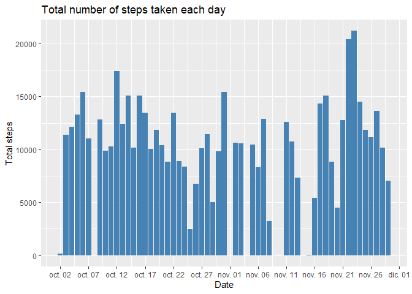
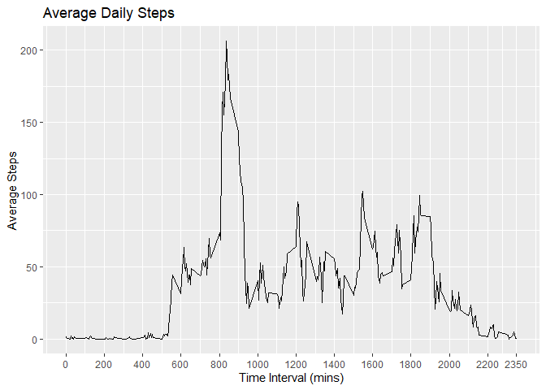
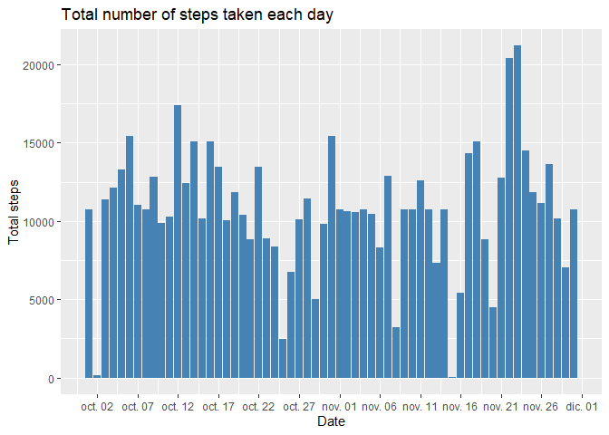
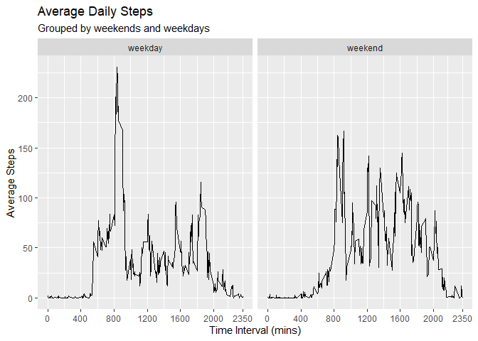

## Loading and preprocessing the data

The data set is contained in the **activity.zip** file therefore, it is unzipped and stored in a folder named *data*. After accessing the information, we appreciate that the `date` column has a `chr` data type that requires a transformation.


```r
unzip("activity.zip", exdir = "./data")
data <- read.csv("./data/activity.csv", header = T)
str(data)
```

```
## 'data.frame':	17568 obs. of  3 variables:
##  $ steps   : int  NA NA NA NA NA NA NA NA NA NA ...
##  $ date    : chr  "2012-10-01" "2012-10-01" "2012-10-01" "2012-10-01" ...
##  $ interval: int  0 5 10 15 20 25 30 35 40 45 ...
```

Formatting `date` column.

```r
data$date <- as.Date(data$date, format = "%Y-%m-%d")
str(data)
```

```
## 'data.frame':	17568 obs. of  3 variables:
##  $ steps   : int  NA NA NA NA NA NA NA NA NA NA ...
##  $ date    : Date, format: "2012-10-01" "2012-10-01" ...
##  $ interval: int  0 5 10 15 20 25 30 35 40 45 ...
```


## What is mean total number of steps taken per day?

We need to subset the information given a day and calculate the total number of steps for each one of them.

In the following picture we can observe the total number of steps for each day.


```r
library(ggplot2)
```

```
## Warning: package 'ggplot2' was built under R version 4.0.5
```

```r
steps_by_day <- aggregate(steps ~ date, data = data, FUN = sum)

ggplot(steps_by_day, aes(x=date, y=steps)) +
      geom_bar(stat = 'identity', fill='steelblue') +
      ggtitle("Total number of steps taken each day") + 
      xlab("Date")+
      ylab("Total steps")+
      scale_x_date(date_breaks = "5 days", date_labels = "%b %d")
```

<!-- -->

Using the previous data frame we can also obtain a summary of the steps by day.  
Here we can appreciate the median and the average steps taken every day.  
*Maximums and minimums are also expressed below.*  


```r
summary_base <- summary(steps_by_day$steps)
summary_base
```

```
##    Min. 1st Qu.  Median    Mean 3rd Qu.    Max. 
##      41    8841   10765   10766   13294   21194
```


## What is the average daily activity pattern?

In order to identify the average daily activity pattern a time-series graph will be generated.  
First data is grouped following a similar pattern as the previously generated.


```r
average_daily_steps <- aggregate(steps ~ interval, data = data, FUN = mean)
head(average_daily_steps)
```

```
##   interval     steps
## 1        0 1.7169811
## 2        5 0.3396226
## 3       10 0.1320755
## 4       15 0.1509434
## 5       20 0.0754717
## 6       25 2.0943396
```

Once that the information is grouped we can proceed to its visualization using a time-series figure.


```r
ggplot(average_daily_steps, aes(x=interval, y= steps)) +
      geom_line() +
      ggtitle("Average Daily Steps") +
      xlab("Time Interval (mins)") +
      ylab("Average Steps") +
      scale_x_continuous(breaks=c(seq(0,2355, by=200), 2350))
```

<!-- -->

We can observe that there is a peak almost at the 850 minutes interval. In order to know precisely the time interval with the greatest number of steps we apply the following code.


```r
index_interval <- which.max(average_daily_steps$steps)
interval_max_steps <- average_daily_steps[index_interval,]
interval_max_steps
```

```
##     interval    steps
## 104      835 206.1698
```
We can observe that the interval **835** has the largest number of steps with a total of **206.17** steps on average.

## Imputing missing values

Since the data loading the presence of *NA's* was noted.The presence of missing days may introduce bias into some calculations or summaries of the data. Therefore, identifying the total rows with *NA's* is critical.


```r
total_observations <- dim(data)[1]
complete_observations <- sum(complete.cases(data))

observations <- list()
observations$missing_values <- total_observations - complete_observations
observations$percentage_equivalent <- observations$missing_values/complete_observations*100
observations
```

```
## $missing_values
## [1] 2304
## 
## $percentage_equivalent
## [1] 15.09434
```
From the previous code we can observe that there are 2304 rows with missing values, this is equivalent to the 15.09% of the data.  
  
To reduce the implications that NA's may have in summaries missing values will be imputed. The imputing strategy will consist of replacing the missing values for the `steps` column with the average steps for a given time interval.


```r
imputed_data <- data
imputed_data$steps <- ave(imputed_data$steps, 
                          imputed_data$interval,
                          FUN = function(x) 
                            ifelse(is.na(x),mean(x, na.rm = T), x)
                          )

head(imputed_data)
```

```
##       steps       date interval
## 1 1.7169811 2012-10-01        0
## 2 0.3396226 2012-10-01        5
## 3 0.1320755 2012-10-01       10
## 4 0.1509434 2012-10-01       15
## 5 0.0754717 2012-10-01       20
## 6 2.0943396 2012-10-01       25
```

The impact of such imputation will be assessed in the following code.


```r
total_daily_steps.imputed <- aggregate(steps ~ date, data = imputed_data, FUN = sum)

ggplot(total_daily_steps.imputed, aes(x=date, y=steps)) +
      geom_bar(stat = 'identity', fill='steelblue') +
      ggtitle("Total number of steps taken each day") + 
      xlab("Date")+
      ylab("Total steps")+
      scale_x_date(date_breaks = "5 days", date_labels = "%b %d")
```

<!-- -->

We observe that the missing values have been imputed. Now, the difference between the imputed values and the original data set will be analyzed by evaluating changes at the median and mean.


```r
summary_imputed <- summary(total_daily_steps.imputed$steps)
summaries <- rbind(summary_base, summary_imputed)
summaries
```

```
##                 Min. 1st Qu.   Median     Mean 3rd Qu.  Max.
## summary_base      41    8841 10765.00 10766.19   13294 21194
## summary_imputed   41    9819 10766.19 10766.19   12811 21194
```
From the previous code we can observe that the values have suffered minor changes at the median. But the first and third quantiles suffered some modifications.

## Are there differences in activity patterns between weekdays and weekends?

Using the `weekdays()` function we will generate a new column for evaluating possible patterns within weekdays and weekends.


```r
weekend_days <-c("sábado", "domingo")
imputed_data$day_type <- as.factor(sapply(imputed_data$date, 
                                function(x) ifelse(weekdays(x) %in% weekend_days,
                                                  "weekend",
                                                  "weekday")))
head(imputed_data$day_type)
```

```
## [1] weekday weekday weekday weekday weekday weekday
## Levels: weekday weekend
```

Once that the observations are classified as a weekday or a weekend we can evaluate the behavior among this classifications.


```r
imputed_data.total_steps <- aggregate(steps ~ interval + day_type, data = imputed_data, FUN = mean)
ggplot(data=imputed_data.total_steps, aes(x=interval, y=steps))+
      geom_line()+
      facet_wrap(.~day_type)+
      ggtitle("Average Daily Steps", "Grouped by weekends and weekdays") +
      xlab("Time Interval (mins)") +
      ylab("Average Steps")+
      scale_x_continuous(breaks=c(seq(0,2355, by=400), 2350))
```

<!-- -->

From the previous graph we can observe that no matter the day type there is an activity peak at the interval **800**. We can also see that the number of steps are significantly greater at weekends, except for the time interval that goes from 500 to 800.
